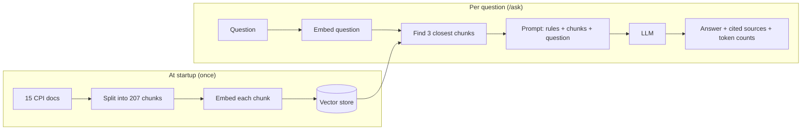

# CPI Assistant

A chatbot that answers **SAP Cloud Platform Integration (CPI)** questions from
a curated set of documentation, using **Retrieval-Augmented Generation (RAG)**.

It is also a learning project. Every part of the RAG pipeline — loading,
chunking, embedding, retrieval, prompting — is built by hand with
[LangChain4j](https://docs.langchain4j.dev), with no auto-configuration hiding
the moving parts.

> New here? Read this page, run the quick start, then follow
> [docs/LEARNING-PATH.md](docs/LEARNING-PATH.md) step by step.
> [docs/ARCHITECTURE.md](docs/ARCHITECTURE.md) explains how the code fits together.

## What it does

Ask the same question two ways:

| Endpoint | What happens | Result for *"How do I connect to a database from an iFlow?"* |
|---|---|---|
| `GET /chat` | The question goes straight to the LLM | Long, confident, **wrong** — describes SAP PI menus that don't exist in CPI |
| `GET /ask` | Relevant doc chunks are retrieved first, then sent with the question | Short, **correct** — JDBC adapter steps from the docs, citing the chunks it used |

And when the docs don't cover a question (*"What is the capital of France?"*),
`/ask` answers **"I don't know"** instead of making something up.

## How RAG works here



The LLM never sees the vector store — only the text of the chunks retrieval
picked. That is the whole idea: the model answers from documents you control
rather than from what it remembers.

## Quick start

### 1. Prerequisites

| Tool | Version | Notes |
|---|---|---|
| JDK | **27** | Gradle's toolchain uses it. If your default `java` is older, run via `./gradlew`, not `java -jar`. With SDKMAN, `sdk env install` picks the version from `.sdkmanrc`. |
| [LM Studio](https://lmstudio.ai) | any recent | Runs the models locally, free, behind an OpenAI-compatible API |
| [Docker](https://www.docker.com) | any recent | Runs Postgres with pgvector, the vector store: `docker compose up -d` (host port 5433). Without it, run with `--cpi.store.type=memory` |

No API key or cloud account is needed for development.

### 2. Start LM Studio with two models

The app needs **two different models**: one that writes text, one that turns
text into vectors.

| Purpose | Model to download in LM Studio | Identifier the app expects |
|---|---|---|
| Chat | Qwen3 14B (`qwen/qwen3-14b`, ~8 GB) — good at tool calling | `qwen/qwen3-14b` |
| Embeddings | Nomic Embed Text v1.5 | `text-embedding-nomic-embed-text-v1.5` |

Load the chat model with a 32K context — `lms load qwen/qwen3-14b --context-length 32768` —
and the embedding model, then start the server (Developer tab → *Start Server*). Check it:

```bash
curl -s localhost:1234/v1/models
# should list both identifiers above
```

### 3. Start the vector store

```bash
docker compose up -d      # Postgres + pgvector on localhost:5433; vectors survive restarts
```

On every start the app re-reads the docs and replaces their chunks in the
store; anything else stored there stays.

### 4. Run

```bash
./gradlew bootRun
```

At startup the app loads, chunks and embeds the docs. Wait for this log line
before asking questions — until then the vector store is empty:

```
=== Embedded 207 segments in ~1500 ms, 768 dimensions each ===
```

### 5. Ask

**In the browser:** open <http://localhost:8080>. The page waits until the
docs are indexed, then lets you ask. Tick *Compare with the model alone* to
see the RAG answer next to the model's answer without documents. Click a
citation chip like `1` to jump to its source.

**From the command line:**

```bash
# With RAG — answer from the docs
curl -G localhost:8080/ask --data-urlencode "question=How do I connect to a database from an iFlow?"

# Without RAG — the model on its own, for comparison
curl -G localhost:8080/chat --data-urlencode "message=How do I connect to a database from an iFlow?"
```

`/ask` returns JSON:

```json
{
  "answer": "To handle errors in an iFlow ... add an Exception Subprocess ([1]) ... use the \"On Error\" setting in the adapter ([2]) ...",
  "sources": [
    { "number": 1, "file": "04-error-handling-in-iflows.txt", "score": 0.87, "excerpt": "..." },
    { "number": 2, "file": "02-jdbc-adapter.txt", "score": 0.86, "excerpt": "..." }
  ],
  "retrievedFrom": ["04-error-handling-in-iflows.txt", "02-jdbc-adapter.txt", "13-data-store-and-variables.txt"],
  "inputTokens": 395,
  "outputTokens": 162,
  "millis": 2400
}
```

- `sources` — the chunks the answer **cites** (`[1]`, `[2]` in the text), with
  a short excerpt so you can check the claim.
- `retrievedFrom` — everything retrieval handed to the model. Here the data
  store chunk was retrieved but not used, so it isn't a source.

### Optional: answer with OpenAI or Claude instead of the local model

`cpi.chat.provider` picks the chat model: `lmstudio` (default), `openai` or
`anthropic`. Embeddings stay on LM Studio, so it must still run with the nomic
model. Every question to a hosted model is a paid API call.

```bash
export ANTHROPIC_API_KEY=...        # or OPENAI_API_KEY (and optionally OPENAI_MODEL)
./gradlew bootRun --args="--cpi.chat.provider=anthropic"
./gradlew eval -Dcpi.chat.provider=anthropic     # evaluations, answered by Claude
```

Model names and limits per provider are under `cpi.chat` in
[`application.yml`](src/main/resources/application.yml).

### 6. Test

```bash
./gradlew test
```

Tests use hand-written fakes for the models, so they run in seconds and do
**not** need LM Studio.

### 7. Evaluate (optional)

```bash
./gradlew eval
```

Runs two evaluations against LM Studio and saves their reports to `build/eval/`:

| Evaluation | What it measures | Report |
|---|---|---|
| `RetrievalEvaluation` | Does the right doc come back? 25 questions across six chunk sizes | `retrieval-report.md` |
| `AnswerEvaluation` | Are the answers right? RAG at two chunk sizes vs all docs in the prompt | `answer-report.md` (with every answer) |
| `CitationEvaluation` | Does each cited chunk support its claim? An LLM judge plus similarity, per (claim, chunk) pair | `citation-report.md` (with passages to check) |

Edit the question sets in `src/test/resources/eval/`. The answer evaluation
puts all docs in one ~16K-token prompt, so load the chat model with a larger
context first: `lms load qwen/qwen3-14b --context-length 32768`. The reports
in the learning path for Steps 10a–10c were measured with Llama 3.1 8B; run
with `-Dcpi.chat.lmstudio.model-name=meta-llama-3.1-8b-instruct` to compare.
Run just one with `./gradlew eval --tests '*AnswerEvaluation'`.

## Endpoints

| Method | Path | Parameter | Purpose |
|---|---|---|---|
| GET | `/` | — | Web UI |
| GET | `/ask` | `question` | RAG answer with cited sources and token usage |
| GET | `/chat` | `message` | Plain LLM call, no retrieval — the baseline |
| GET | `/agent` | `question` | The agent: picks its own tools — the docs, and the CPI tenant (iFlows, failed messages, errors); lists every tool call |
| GET | `/fake-cpi/api/v1/...` | OData | A stand-in CPI tenant with planted failures — same paths and JSON as the real API (`cpi.tenant.fake=true`) |
| GET | `/status` | — | `{"ready": true, "indexedSegments": 207}` — whether the docs are indexed yet |

## Configuration

All settings are in [`src/main/resources/application.yml`](src/main/resources/application.yml)
and can be overridden on the command line:

```bash
./gradlew bootRun --args="--cpi.ingestion.max-segment-size=300 --cpi.retrieval.min-score=0.82"
```

| Property | Default | Meaning |
|---|---|---|
| `cpi.ingestion.max-segment-size` | `500` | Largest chunk, in characters |
| `cpi.ingestion.max-overlap-size` | `50` | Characters repeated between neighbouring chunks |
| `cpi.ingestion.run-on-startup` | `true` | Load and embed the docs at startup (tests set it to `false`) |
| `cpi.retrieval.min-score` | `0.80` | Relevance floor. On a `(cosine + 1) / 2` scale — see the learning path |
| `cpi.chat.provider` | `lmstudio` | Chat model: `lmstudio`, `openai` (needs `OPENAI_API_KEY`) or `anthropic` (needs `ANTHROPIC_API_KEY`) — see above |
| `cpi.chat.lmstudio.*` / `.openai.*` / `.anthropic.*` | Qwen3 14B at temperature 0.0 / `gpt-5-mini` / Claude Opus 5.5 | Endpoint, key, model name and limits per provider |
| `cpi.chat.timeout`, `cpi.chat.max-retries` | `3m`, LangChain4j's 2 | Per chat call, whichever provider |
| `cpi.store.type` | `pgvector` | `pgvector` (Docker, persistent) or `memory` (rebuilt every start; tests use it) |
| `cpi.store.pgvector.*` | localhost:5433, db/user/password `cpi`, table `cpi_chunks`, 768 dims | Connection and table |
| `cpi.tenant.fake` | `true` | Serve the fake CPI tenant at `/fake-cpi/api/v1` |
| `cpi.tenant.base-url` | the fake tenant | CPI OData API the tenant tools read |
| `langchain4j.open-ai.embedding-model.*` | LM Studio / nomic v1.5 | Embedding model, plus nomic's `query-prefix` / `document-prefix` |

> The score floor and the prefixes are tuned for nomic-embed-text. Switching
> embedding model means re-measuring the floor and clearing the prefixes.

## The knowledge base

15 hand-prepared text files in [`src/main/resources/cpi-docs/`](src/main/resources/cpi-docs/)
(~73K characters, ~20K tokens), drawn from the SAP Help Portal, SAP Community
posts and personal CPI notes. Topics: CPI overview, JDBC adapter, scripting,
error handling, adapters, message mapping, B2B / AS2 / EDI / cXML, Partner
Directory, routing, security, data store.

To add knowledge, drop a `.txt` file in that folder and restart.

## Tech stack

Java 27 · Spring Boot 4.1.1 · LangChain4j 1.20.0 (core only) ·
Gradle 9.7.1 (Kotlin DSL) · LM Studio · PostgreSQL 18 + pgvector (Docker) ·
JUnit 5 / AssertJ · Testcontainers

## Project status

| | Step | |
|---|---|---|
| ✅ | 1–3 | Project setup, basic chat, docs prepared |
| ✅ | 4 | Chunking |
| ✅ | 5 | Embeddings + semantic search |
| ✅ | 6 | RAG: retrieve, then generate |
| ✅ | 7 | Persistent vector store: pgvector in Docker (done after Step 13) |
| ✅ | 8 | Source references in answers |
| ✅ | 9 | Web UI |
| 🔶 | 10 | Tuning and evaluation — local part done: retrieval, answers, citations. A stronger model and judge wait for API credit |
| ✅ | 11 | One switch for the chat model: LM Studio, OpenAI or Anthropic |
| ✅ | 12 | Retrieval as a tool (`/agent`); Qwen3 14B is now the default local chat model |
| ✅ | 13 | CPI tenant tools over the OData API, against a fake tenant (real tenant: needs OAuth) |

Then: tools and an agent with LangChain4j.
Details in [docs/LEARNING-PATH.md](docs/LEARNING-PATH.md).

## License

[MIT](LICENSE)
