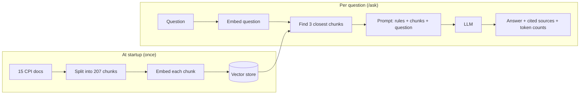

# CPI Assistant

A chatbot that answers **SAP Cloud Platform Integration (CPI)** questions from
a curated set of documentation, using **Retrieval-Augmented Generation (RAG)**.

It is also a learning project. Every part of the RAG pipeline — loading,
chunking, embedding, retrieval, prompting — is built by hand with
[LangChain4j](https://docs.langchain4j.dev), with no auto-configuration hiding
the moving parts. A second track does the same with
[Spring AI](https://docs.spring.io/spring-ai/reference/) for comparison.

> New here? Read this page, run the quick start, then follow
> [docs/LEARNING-PATH.md](docs/LEARNING-PATH.md) step by step.
> [docs/ARCHITECTURE.md](docs/ARCHITECTURE.md) explains how the code fits together.

## What it does

Ask the same question two ways:

| Endpoint | What happens | Result for *"How do I connect to a database from an iFlow?"* |
|---|---|---|
| `GET /chat` | The question goes straight to the LLM | Long, confident, **wrong** — describes SAP PI menus that don't exist in CPI |
| `GET /ask` | Relevant doc chunks are retrieved first, then sent with the question | Short, **correct** — JDBC adapter steps from the docs, citing the chunks it used |

And when the docs don't cover a question (*"What is the capital of France?"*),
`/ask` answers **"I don't know"** instead of making something up.

## How RAG works here



The LLM never sees the vector store — only the text of the chunks retrieval
picked. That is the whole idea: the model answers from documents you control
rather than from what it remembers.

## Quick start

### 1. Prerequisites

| Tool | Version | Notes |
|---|---|---|
| JDK | **26** | Gradle's toolchain uses it. If your default `java` is older, run via `./gradlew`, not `java -jar`. |
| [LM Studio](https://lmstudio.ai) | any recent | Runs the models locally, free, behind an OpenAI-compatible API |

No API key or cloud account is needed for development.

### 2. Start LM Studio with two models

The app needs **two different models**: one that writes text, one that turns
text into vectors.

| Purpose | Model to download in LM Studio | Identifier the app expects |
|---|---|---|
| Chat | Meta Llama 3.1 8B Instruct (`lmstudio-community/Meta-Llama-3.1-8B-Instruct-GGUF`) | `meta-llama-3.1-8b-instruct` |
| Embeddings | Nomic Embed Text v1.5 | `text-embedding-nomic-embed-text-v1.5` |

Load both, then start the server (Developer tab → *Start Server*). Check it:

```bash
curl -s localhost:1234/v1/models
# should list both identifiers above
```

### 3. Run

```bash
./gradlew bootRun
```

At startup the app loads, chunks and embeds the docs. Wait for this log line
before asking questions — until then the vector store is empty:

```
=== Embedded 207 segments in ~1500 ms, 768 dimensions each ===
```

### 4. Ask

**In the browser:** open <http://localhost:8080>. The page waits until the
docs are indexed, then lets you ask. Tick *Compare with the model alone* to
see the RAG answer next to the model's answer without documents. Click a
citation chip like `1` to jump to its source.

**From the command line:**

```bash
# With RAG — answer from the docs
curl -G localhost:8080/ask --data-urlencode "question=How do I connect to a database from an iFlow?"

# Without RAG — the model on its own, for comparison
curl -G localhost:8080/chat --data-urlencode "message=How do I connect to a database from an iFlow?"
```

`/ask` returns JSON:

```json
{
  "answer": "To handle errors in an iFlow ... add an Exception Subprocess ([1]) ... use the \"On Error\" setting in the adapter ([2]) ...",
  "sources": [
    { "number": 1, "file": "04-error-handling-in-iflows.txt", "score": 0.87, "excerpt": "..." },
    { "number": 2, "file": "02-jdbc-adapter.txt", "score": 0.86, "excerpt": "..." }
  ],
  "retrievedFrom": ["04-error-handling-in-iflows.txt", "02-jdbc-adapter.txt", "13-data-store-and-variables.txt"],
  "inputTokens": 395,
  "outputTokens": 162,
  "millis": 2400
}
```

- `sources` — the chunks the answer **cites** (`[1]`, `[2]` in the text), with
  a short excerpt so you can check the claim.
- `retrievedFrom` — everything retrieval handed to the model. Here the data
  store chunk was retrieved but not used, so it isn't a source.

### 5. Test

```bash
./gradlew test
```

Tests use hand-written fakes for the models, so they run in seconds and do
**not** need LM Studio.

## Endpoints

| Method | Path | Parameter | Purpose |
|---|---|---|---|
| GET | `/` | — | Web UI |
| GET | `/ask` | `question` | RAG answer with cited sources and token usage (LangChain4j) |
| GET | `/chat` | `message` | Plain LLM call, no retrieval — the baseline (LangChain4j) |
| GET | `/springai/chat` | `message` | Plain LLM call through Spring AI, for comparing frameworks |
| GET | `/status` | — | `{"ready": true, "indexedSegments": 207}` — whether the docs are indexed yet |

## Configuration

All settings are in [`src/main/resources/application.yml`](src/main/resources/application.yml)
and can be overridden on the command line:

```bash
./gradlew bootRun --args="--cpi.ingestion.max-segment-size=300 --cpi.retrieval.min-score=0.82"
```

| Property | Default | Meaning |
|---|---|---|
| `cpi.ingestion.max-segment-size` | `500` | Largest chunk, in characters |
| `cpi.ingestion.max-overlap-size` | `50` | Characters repeated between neighbouring chunks |
| `cpi.ingestion.run-on-startup` | `true` | Load and embed the docs at startup (tests set it to `false`) |
| `cpi.retrieval.min-score` | `0.80` | Relevance floor. On a `(cosine + 1) / 2` scale — see the learning path |
| `langchain4j.open-ai.chat-model.*` | LM Studio / Llama 3.1 8B | Chat model endpoint and name |
| `langchain4j.open-ai.embedding-model.*` | LM Studio / nomic v1.5 | Embedding model, plus nomic's `query-prefix` / `document-prefix` |

> The score floor and the prefixes are tuned for nomic-embed-text. Switching
> embedding model means re-measuring the floor and clearing the prefixes.

## The knowledge base

15 hand-prepared text files in [`src/main/resources/cpi-docs/`](src/main/resources/cpi-docs/)
(~73K characters, ~20K tokens), drawn from the SAP Help Portal, SAP Community
posts and personal CPI notes. Topics: CPI overview, JDBC adapter, scripting,
error handling, adapters, message mapping, B2B / AS2 / EDI / cXML, Partner
Directory, routing, security, data store.

To add knowledge, drop a `.txt` file in that folder and restart.

## Tech stack

Java 26 · Spring Boot 4.1 · LangChain4j 1.20 (core only) · Spring AI 2.0 ·
Gradle 9.7 (Kotlin DSL) · LM Studio · JUnit 5 / AssertJ

## Project status

| | Step | |
|---|---|---|
| ✅ | 1–3 | Project setup, basic chat, docs prepared |
| ✅ | 4 | Chunking |
| ✅ | 5 | Embeddings + semantic search |
| ✅ | 6 | RAG: retrieve, then generate |
| ⬜ | 7 | Persistent vector store (pgvector) |
| ✅ | 8 | Source references in answers |
| ✅ | 9 | Web UI |
| ⬜ | 10 | Tuning and evaluation |

Then: an agent with LangChain4j, and a production version with Spring AI.
Details in [docs/LEARNING-PATH.md](docs/LEARNING-PATH.md).

## License

[MIT](LICENSE)
