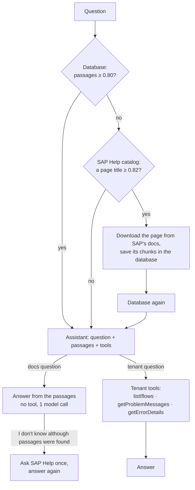

# CPI Assistant

An assistant for **SAP Cloud Integration (CPI)**. It answers from the
**official SAP documentation**, which it downloads and keeps as it goes, and
looks at a **CPI tenant** when a question is about what is happening there.

It is also a learning project: retrieval, prompting, tool calling and the
knowledge store are built by hand with [LangChain4j](https://docs.langchain4j.dev),
with no auto-configuration hiding the moving parts.

> New here? Read this page, run the quick start and the QA checklist, then
> follow [docs/LEARNING-PATH.md](docs/LEARNING-PATH.md).
> [docs/ARCHITECTURE.md](docs/ARCHITECTURE.md) explains how the code fits together.

## How it works — one path for every question



1. **Find documentation — code, no model.** Search the vector store. On a miss,
   look the question up in a catalog of ~1,660 official SAP pages; if a title
   matches well enough, download that page, save it, search again. The next
   question on the topic stops at the store.
2. **Answer — one assistant.** The model gets the question, the passages and
   the tools. It decides: a documentation question is answered from the
   passages with no tool; a question about the live tenant makes it call the
   tenant tools. There is no router and no mode.
3. **Check.** If the answer is "I don't know" although passages were found,
   they were close but wrong (AS2 for AS4): SAP Help is asked once more. Every
   page the answer cites is checked against the pages the model was actually
   given.

Every answer comes back with its **path** — what was searched, downloaded and
called — so you can see which of these happened.

## Quick start

### 1. Prerequisites

| Tool | Version | Notes |
|---|---|---|
| JDK | **27** | Gradle's toolchain uses it. If your default `java` is older, run via `./gradlew`. With SDKMAN, `sdk env install` picks the version from `.sdkmanrc`. |
| [LM Studio](https://lmstudio.ai) | any recent | Runs the models locally, free, behind an OpenAI-compatible API |
| [Docker](https://www.docker.com) | any recent | Runs Postgres with pgvector, the knowledge store |

Internet access is needed to download SAP documentation pages. No API key or
cloud account is needed.

### 2. Start LM Studio with two models

| Purpose | Model in LM Studio | Identifier the app expects |
|---|---|---|
| Chat | Qwen3 14B (`qwen/qwen3-14b`, ~8 GB) — good at tool calling | `qwen/qwen3-14b` |
| Embeddings | Nomic Embed Text v1.5 | `text-embedding-nomic-embed-text-v1.5` |

```bash
lms load qwen/qwen3-14b --context-length 32768 --identifier qwen/qwen3-14b -y
curl -s localhost:1234/v1/models      # should list both identifiers
```

### 3. Start the knowledge store

```bash
docker compose up -d      # Postgres + pgvector on localhost:5433; data survives restarts
```

### 4. Run

```bash
./gradlew bootRun
```

At startup the app saves ten popular SAP pages (JDBC, HTTP, SFTP and OData
receivers, error handling, scripting, monitoring …) unless they are already
saved, and embeds the catalog titles. Wait for:

```
=== Knowledge ready: 10 of 10 seed pages saved, 1660 catalog titles embedded, ~23000 ms ===
```

### 5. Ask

**In the browser:** open <http://localhost:8080>. Each answer shows its path
(→ lines), its sources with links to the SAP page, a ⚠ on any page it cites
without having been given it, and — when the tenant was involved — every tool
call with its full result.

**From the command line:**

```bash
curl -s -G localhost:8080/assist --data-urlencode "question=How do I configure a JDBC adapter?" | jq
```

```json
{
  "answer": "… [JDBC Receiver Adapter]",
  "path": ["Database: 3 passage(s), best 0.911", "Answered from the passages, no tool"],
  "sources": [{ "title": "JDBC Receiver Adapter", "url": "https://github.com/SAP-docs/…/jdbc-receiver-adapter-88be644.md",
                "score": 0.911, "excerpt": "…", "cited": true }],
  "unverifiedCitations": [],
  "toolCalls": [],
  "inputTokens": 1105, "outputTokens": 353, "millis": 22600
}
```

| Field | Meaning |
|---|---|
| `path` | What happened, in order: database hit or miss, SAP download, tool calls |
| `sources` | Every page the model was given; `cited` says whether the answer used it |
| `unverifiedCitations` | Pages the answer cites that the model was **never given** — should be empty |
| `toolCalls` | Each tool call: name, arguments, full result |

## QA checklist — what to ask, and what you should see

Start from an empty store to see every path (`docker exec cpi-assistant-pgvector
psql -U cpi -d cpi -c "truncate cpi_chunks;"`, then restart the app). Measured
with Qwen3 14B on an M4 Max:

| # | Ask | Expected path | Checks |
|---|---|---|---|
| 1 | How do I configure a JDBC adapter? | `Database: 3 passage(s)` → `Answered from the passages, no tool` | **RAG only**, 1 model call, cites [JDBC Receiver Adapter] · ~20 s |
| 2 | How do I handle errors in an iFlow? | Database hit → no tool | Cites [Handle Errors Gracefully] |
| 3 | How do I configure the AS4 receiver adapter? | Database (AS2 passages) → "I don't know" → `SAP Help: downloaded "AS4 Receiver Adapter"` → answered | **Download + save** |
| 4 | *the same AS4 question again* | `Database: … best 0.904` → no tool | **From the database, no download** · ~11 s |
| 5 | Why did Order_Sync fail today and how do I fix it? | Database → `Tool: getProblemMessages` → `Tool: getErrorDetails` → answered | **Tools** — JDBC pool timeout on ORDER_DB |
| 6 | Is Payment_Status_Poll failing? | `Tool: getProblemMessages` → `getErrorDetails` → `searchDocs` | Finds the **RETRY** message (SFTP connection refused) and looks up the fix · ~140 s |
| 7 | What is the capital of France? | `Database: nothing above the 0.80 floor` → `SAP Help: no page title matches well enough` | **No download**, declines · ~7 s |
| 8 | Why did Unknown_Flow fail? | `Tool: getProblemMessages` → `listIflows` | "Does not exist" — no invented failure |
| 9 | Why did Order_Synk fail today? *(typo)* | problem messages → `listIflows` | Suggests Order_Sync |
| 10 | How do I configure JDBC and SFTP receiver adapters? | Database hit → no tool | Covers both from the passages |

`unverifiedCitations` should be empty; when the model puts something in
brackets it was never given (it did once: "[this blog]"), the answer shows it
with ⚠. Not yet tried: a question in another language, and a question after
`docker compose down` (expected: an error — the store is required).

**See everything a question did:**

```bash
# the path, sources and tool calls of one answer
curl -s -G localhost:8080/assist --data-urlencode "question=Why did Order_Sync fail today?" \
  | jq '{path, cited: [.sources[] | select(.cited) | .title], unverifiedCitations, tools: [.toolCalls[] | {tool, arguments}]}'

# what the knowledge store holds, per page
docker exec cpi-assistant-pgvector psql -U cpi -d cpi -c \
  "select metadata->>'title' as page, count(*) as chunks from cpi_chunks group by 1 order by 1;"
```

The application log shows every request to the model and every response,
including the tool calls it asks for (`cpi.chat.log-requests` /
`log-responses`). Breakpoints that show the flow: `AssistService.assist`,
`KnowledgeService.find`, `SapHelpClient.fetch` (a download), and the tool
methods in `CpiTenantTools` and `CpiDocsTool`.

### Optional: answer with OpenAI or Claude instead of the local model

`cpi.chat.provider` picks the chat model: `lmstudio` (default), `openai` or
`anthropic`. Embeddings stay on LM Studio. Every question to a hosted model is
a paid API call.

```bash
export ANTHROPIC_API_KEY=...        # or OPENAI_API_KEY (and optionally OPENAI_MODEL)
./gradlew bootRun --args="--cpi.chat.provider=anthropic"
```

### 6. Test

```bash
./gradlew test
```

33 tests, fakes for the models and for GitHub: no LM Studio and no internet.
`PgVectorStoreTest` starts a throwaway pgvector container, so it needs Docker.

## Endpoints

| Method | Path | Parameter | Purpose |
|---|---|---|---|
| GET | `/` | — | Web UI |
| GET | `/assist` | `question` | The assistant: answer, path, sources, unverified citations, tool calls |
| GET | `/status` | — | `{"ready": true, "savedPages": 10, "seedPages": 10}` — ready once the popular pages are saved |
| GET | `/fake-cpi/api/v1/...` | OData | A stand-in CPI tenant with planted failures — same paths and JSON as the real API. Not part of the assistant; off with `cpi.tenant.fake=false` |

## Configuration

All settings are in [`src/main/resources/application.yml`](src/main/resources/application.yml)
and can be overridden on the command line (`--name=value`).

| Property | Default | Meaning |
|---|---|---|
| `cpi.chat.provider` | `lmstudio` | Chat model: `lmstudio`, `openai` (needs `OPENAI_API_KEY`) or `anthropic` (needs `ANTHROPIC_API_KEY`) |
| `cpi.chat.lmstudio.*` / `.openai.*` / `.anthropic.*` | Qwen3 14B at temperature 0.0 / `gpt-5-mini` / Claude Opus 5.5 | Endpoint, key, model name and limits per provider |
| `cpi.chat.timeout`, `cpi.chat.max-retries` | `3m`, LangChain4j's 2 | Per chat call |
| `cpi.retrieval.min-score` | `0.80` | Below this the store counts as a miss. On a `(cosine + 1) / 2` scale |
| `cpi.knowledge.min-title-score` | `0.82` | A SAP page is downloaded only if its title matches this well (real CPI questions: 0.83–0.95; off-topic: up to 0.80) |
| `cpi.knowledge.max-pages-per-miss` | `1` | Pages downloaded per miss |
| `cpi.knowledge.max-age` | `30d` | A saved page older than this is downloaded again |
| `cpi.knowledge.seed-pages` | 10 popular pages | Saved at startup unless already saved |
| `cpi.knowledge.sap-help-url` | SAP-docs/btp-integration-suite on raw.githubusercontent.com | Where pages are downloaded from |
| `cpi.ingestion.max-segment-size` / `max-overlap-size` | `500` / `50` | Chunk size and overlap, in characters |
| `cpi.store.type` | `pgvector` | `pgvector` (Docker, persistent) or `memory` (tests) |
| `cpi.store.pgvector.*` | localhost:5433, db/user/password `cpi`, table `cpi_chunks`, 768 dims | Connection and table |
| `cpi.tenant.fake` / `cpi.tenant.base-url` | `true` / the fake tenant | The CPI OData API the tenant tools read |
| `langchain4j.open-ai.embedding-model.*` | LM Studio / nomic v1.5 | Embedding model, plus nomic's `query-prefix` / `document-prefix` |

> The score thresholds and the prefixes are tuned for nomic-embed-text.
> Switching the embedding model means re-measuring them and emptying the store.

## The knowledge

One source of truth: the **official SAP Integration Suite documentation**,
from [SAP-docs/btp-integration-suite](https://github.com/SAP-docs/btp-integration-suite)
— the Markdown source of help.sap.com, © SAP SE, licensed
[CC BY 4.0](https://creativecommons.org/licenses/by/4.0/). Answers cite each
page by title and link to it.

- [`sap-help/catalog.tsv`](src/main/resources/sap-help/catalog.tsv) lists the
  ~1,660 pages the assistant may download — pinned to a commit of that
  repository. The model never fetches a URL of its choosing.
- Only SAP's text is saved, never a model's answer.
- help.sap.com itself is not fetched: it renders pages with JavaScript and its
  robots.txt disallows automated clients.

**Known limits:** a page is found by its title, so an *overview* page can win
over the *Configure the …* page that has the steps (JDBC, AS4). For a
"why did it fail and how do I fix it" question the model does not always look
the fix up in the docs — it then answers the fix without a citation.

## Tech stack

Java 27 · Spring Boot 4.1.1 · LangChain4j 1.20.0 (core only) ·
Gradle 9.7.1 (Kotlin DSL) · LM Studio (Qwen3 14B, nomic-embed-text) ·
PostgreSQL 18 + pgvector (Docker) · JUnit 5 / AssertJ · Testcontainers

## Project status

| | Step | |
|---|---|---|
| ✅ | 1–10 | RAG built and measured by hand: chunking, embeddings, retrieval, citations, web UI, evaluations |
| ✅ | 11 | One switch for the chat model: LM Studio, OpenAI or Anthropic |
| ✅ | 12–13 | Tool calling: documentation search, CPI tenant tools over the OData API (fake tenant; real one needs OAuth) |
| ✅ | 7, 14 | Persistent knowledge: pgvector in Docker, SAP Help pages downloaded on a miss and kept |
| ✅ | 15 | One assistant: one endpoint, official SAP docs as the only source, citations checked |

Every step — what was built, why, what was measured — is in
[docs/LEARNING-PATH.md](docs/LEARNING-PATH.md).

## License

[MIT](LICENSE). SAP documentation content: © SAP SE, CC BY 4.0.
