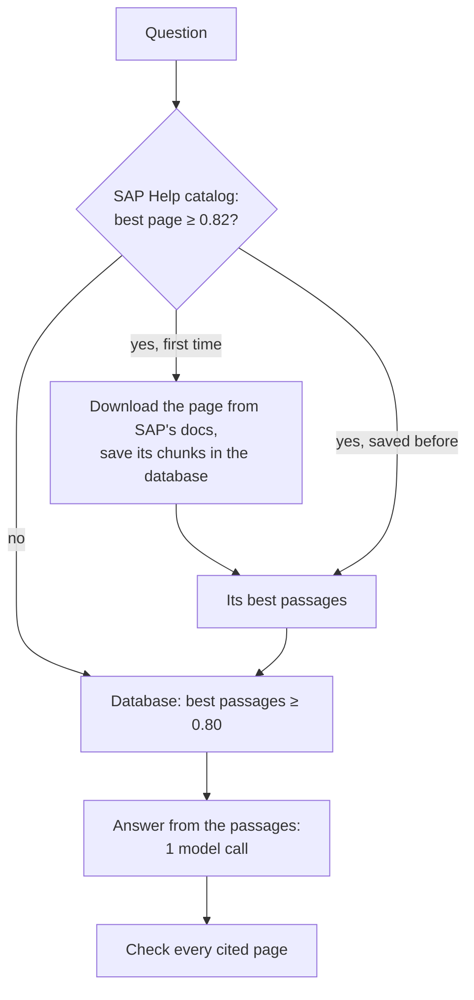

# CPI Assistant

An assistant for **SAP Cloud Integration (CPI)**. It answers from the
**official SAP documentation**, which it downloads and keeps as it goes.
One question box: it finds the right SAP page, answers from it, and cites it.

It is also a learning project: retrieval, prompting and the
knowledge store are built by hand with [LangChain4j](https://docs.langchain4j.dev),
with no auto-configuration hiding the moving parts.

> New here? Read this page, run the quick start and the QA checklist, then
> follow [docs/LEARNING-PATH.md](docs/LEARNING-PATH.md).
> [docs/ARCHITECTURE.md](docs/ARCHITECTURE.md) explains how the code fits together.

## How it works — one path for every question


```mermaid
flowchart TB
    Q[Question] --> CAT{SAP Help catalog:<br/>best page ≥ 0.82?}
    CAT -- "yes, first time" --> DL[Download the page from SAP's docs,<br/>save its chunks in the database] --> P[Its best passages]
    CAT -- "yes, saved before" --> P
    CAT -- no --> DB
    P --> DB[Database: best passages ≥ 0.80]
    DB --> A[Answer from the passages:<br/>1 model call]
    A --> C[Check every cited page]
```

1. **Find documentation — code, no model.** Look the question up in a catalog
   of ~1,660 official SAP pages. If the best page matches well enough, make
   sure it is saved — downloaded the first time, from the database after
   that — and take its best passages. Add the best passages from the whole
   database. Pages and passages are ranked by meaning *and* by keywords.
2. **Answer — one model call.** The model gets the question and the passages,
   and answers only from them, citing each page by its title.
3. **Check.** Every page the answer cites is checked against the pages the
   model was actually given.

Every answer comes back with its **path** — what was searched, downloaded and
called — so you can see which of these happened.

## Quick start

### 1. Prerequisites

| Tool | Version | Notes |
|---|---|---|
| JDK | **27** | Gradle's toolchain uses it. If your default `java` is older, run via `./gradlew`. With SDKMAN, `sdk env install` picks the version from `.sdkmanrc`. |
| [LM Studio](https://lmstudio.ai) | any recent | Runs the models locally, free, behind an OpenAI-compatible API |
| [Docker](https://www.docker.com) | any recent | Runs Postgres with pgvector, the knowledge store |

Internet access is needed to download SAP documentation pages. No API key or
cloud account is needed.

### 2. Start LM Studio with two models

| Purpose | Model in LM Studio | Identifier the app expects |
|---|---|---|
| Chat | Qwen3 14B (`qwen/qwen3-14b`, ~8 GB) — answers from the passages and cites them | `qwen/qwen3-14b` |
| Embeddings | Nomic Embed Text v1.5 | `text-embedding-nomic-embed-text-v1.5` |

```bash
lms load qwen/qwen3-14b --context-length 32768 --identifier qwen/qwen3-14b -y
curl -s localhost:1234/v1/models      # should list both identifiers
```

### 3. Start the knowledge store

```bash
docker compose up -d      # Postgres + pgvector on localhost:5433; data survives restarts
```

### 4. Run

```bash
./gradlew bootRun
```

At startup the app saves ten popular SAP pages (JDBC, HTTP, SFTP and OData
receivers, error handling, scripting, monitoring …) unless they are already
saved, and embeds the catalog titles. Wait for:

```
=== Knowledge ready: 10 of 10 seed pages saved, 1660 catalog titles embedded, ~23000 ms ===
```

### 5. Ask

**In the browser:** open <http://localhost:8080>. Each answer shows its path
(→ lines), its sources with links to the SAP page, and a ⚠ on any page it cites
without having been given it.

**From the command line:**

```bash
curl -s -G localhost:8080/assist --data-urlencode "question=How do I configure a JDBC adapter?" | jq
```

```json
{
  "answer": "… [JDBC Receiver Adapter]",
  "path": ["SAP Help: best page \"JDBC Receiver Adapter\" (match 0.909), already saved",
           "Database: 3 passage(s), best 0.905", "Answered"],
  "sources": [{ "title": "JDBC Receiver Adapter", "url": "https://github.com/SAP-docs/…/jdbc-receiver-adapter-88be644.md",
                "score": 0.911, "excerpt": "…", "cited": true }],
  "unverifiedCitations": [],
  "inputTokens": 1105, "outputTokens": 353, "millis": 22600
}
```

| Field | Meaning |
|---|---|
| `path` | What happened, in order: the SAP page (downloaded or already saved), the database, the answer |
| `sources` | Every page the model was given; `cited` says whether the answer used it |
| `unverifiedCitations` | Pages the answer cites that the model was **never given** — should be empty |

## QA checklist — what to ask, and what you should see

**Run it all at once:**

```bash
./scripts/qa.sh                              # app on localhost:8080
BASE=http://localhost:8081 ./scripts/qa.sh   # another port
```

It asks eight questions and checks the **path** and the sources of each
answer: store hit, first download, the same question again from the store,
off-topic and not-CPI without a download, the exact page for a narrow
question, a cited source, AS4 without AS2. It removes the AS4 pages from the
store first, so the download case works on every run. Prints ✅/❌ per case;
exit code 0 when all pass (~2 minutes with Qwen3 14B).

**Or ask by hand:**

Start from an empty store to see every path (`docker exec cpi-assistant-pgvector
psql -U cpi -d cpi -c "truncate cpi_chunks;"`, then restart the app). Measured
with Qwen3 14B on an M4 Max:

| # | Ask | Expected path | Checks |
|---|---|---|---|
| 1 | How do I configure a JDBC adapter? | `SAP Help: best page "JDBC Receiver Adapter" … already saved` → `Database: 3 passage(s)` → `Answered` | Drivers → data source → Cloud Connector; cites [JDBC Receiver Adapter] · ~10–30 s |
| 2 | How do I handle errors in an iFlow? | `SAP Help: downloaded "Handle Errors in Successful Responses"` (first time) → `Database` | Cites the error-handling pages |
| 3 | How do I configure the AS4 receiver adapter? | `SAP Help: downloaded "AS4 Receiver Adapter"` → `Database: 3 passage(s)` → `Answered` | **Download + save** · ~7–20 s |
| 4 | *the same AS4 question again* | `SAP Help: best page "AS4 Receiver Adapter" … already saved` | **From the database, no download** |
| 5 | How do I set up an SFTP receiver with known hosts? | `SAP Help: … "Maintaining SSH Known Hosts for SFTP Connectivity"` | The exact page, not the general SFTP one |
| 6 | How do I configure the Kafka receiver adapter? | `SAP Help: … "Configure the Kafka Receiver Adapter"` | Cites the Kafka page |
| 7 | What is the capital of France? | `SAP Help: no page matches well enough` → `Database: nothing above the 0.80 floor` | **No download**, declines |
| 8 | How do I configure JDBC and SFTP receiver adapters? | one best page + the store's best | Both topics, from the passages |

`unverifiedCitations` should be empty. It lists a bracketed name only if it
appears nowhere in what the model was given (it happened: "[this blog]",
"[HTTP Receiver Adapter: Retry Iterations]"); the answer shows it with ⚠. A
page a passage merely mentions ("see Configure JDBC Drivers") is not flagged. Not yet tried: a question in another language, and a question after
`docker compose down` (expected: an error — the store is required).

**See everything a question did:**

```bash
# the path and sources of one answer
curl -s -G localhost:8080/assist --data-urlencode "question=How do I configure the Kafka receiver adapter?" \
  | jq '{path, cited: [.sources[] | select(.cited) | .title], unverifiedCitations}'

# what the knowledge store holds, per page
docker exec cpi-assistant-pgvector psql -U cpi -d cpi -c \
  "select metadata->>'title' as page, count(*) as chunks from cpi_chunks group by 1 order by 1;"
```

The application log shows every request to the model and every response
(`cpi.chat.log-requests` / `log-responses`). Breakpoints that show the flow:
`AssistService.assist`, `KnowledgeService.find` and `SapHelpClient.fetch`
(a download).

### Optional: answer with OpenAI or Claude instead of the local model

`cpi.chat.provider` picks the chat model: `lmstudio` (default), `openai` or
`anthropic`. Embeddings stay on LM Studio. Every question to a hosted model is
a paid API call.

```bash
export ANTHROPIC_API_KEY=...        # or OPENAI_API_KEY (and optionally OPENAI_MODEL)
./gradlew bootRun --args="--cpi.chat.provider=anthropic"
```

### 6. Test

```bash
./gradlew test
```

32 tests, fakes for the models and for GitHub: no LM Studio and no internet.
Answer quality against the real model: `./scripts/qa.sh` (above).
RAG compared with a model that searches the files itself: `./gradlew measure`
(LM Studio, pgvector, internet; ~15 min; report in `build/measure/`).
`PgVectorStoreTest` starts a throwaway pgvector container, so it needs Docker.

## Endpoints

| Method | Path | Parameter | Purpose |
|---|---|---|---|
| GET | `/` | — | Web UI |
| GET | `/assist` | `question` (1–1,000 characters) | The assistant: answer, path, sources, unverified citations |
| GET | `/status` | — | `{"ready": true, "savedPages": 10, "seedPages": 10}` — ready once the popular pages are saved |

## Configuration

All settings are in [`src/main/resources/application.yml`](src/main/resources/application.yml)
and can be overridden on the command line (`--name=value`).

| Property | Default | Meaning |
|---|---|---|
| `cpi.chat.provider` | `lmstudio` | Chat model: `lmstudio`, `openai` (needs `OPENAI_API_KEY`) or `anthropic` (needs `ANTHROPIC_API_KEY`) |
| `cpi.chat.lmstudio.*` / `.openai.*` / `.anthropic.*` | Qwen3 14B at temperature 0.0 / `gpt-5-mini` / Claude Opus 5.5 | Endpoint, key, model name and limits per provider |
| `cpi.chat.timeout`, `cpi.chat.max-retries` | `3m`, LangChain4j's 2 | Per chat call |
| `cpi.retrieval.min-score` | `0.80` | A passage below this is not used. On a `(cosine + 1) / 2` scale |
| `cpi.knowledge.min-title-score` | `0.82` | A SAP page is downloaded only if its title matches this well (real CPI questions: 0.83–0.95; off-topic: up to 0.80) |
| `cpi.knowledge.max-age` | `30d` | A saved page older than this is downloaded again |
| `cpi.knowledge.seed-pages` | 10 popular pages | Saved at startup unless already saved |
| `cpi.knowledge.sap-help-url` | SAP-docs/btp-integration-suite on raw.githubusercontent.com | Where pages are downloaded from |
| `cpi.ingestion.max-segment-size` / `max-overlap-size` | `500` / `50` | Chunk size and overlap, in characters |
| `cpi.store.type` | `pgvector` | `pgvector` (Docker, persistent) or `memory` (tests) |
| `cpi.store.pgvector.*` | localhost:5433, db/user/password `cpi`, table `cpi_chunks`, 768 dims | Connection and table |
| `langchain4j.open-ai.embedding-model.*` | LM Studio / nomic v1.5 | Embedding model, plus nomic's `query-prefix` / `document-prefix` |

> The score thresholds and the prefixes are tuned for nomic-embed-text.
> Switching the embedding model means re-measuring them and emptying the store.

## The knowledge

One source of truth: the **official SAP Integration Suite documentation**,
from [SAP-docs/btp-integration-suite](https://github.com/SAP-docs/btp-integration-suite)
— the Markdown source of help.sap.com, © SAP SE, licensed
[CC BY 4.0](https://creativecommons.org/licenses/by/4.0/). Answers cite each
page by title and link to it.

- [`sap-help/catalog.tsv`](src/main/resources/sap-help/catalog.tsv) lists the
  ~1,660 pages the assistant may download, each with its heading and first
  sentence — pinned to a commit of that repository and rebuilt with
  `python3 scripts/build_sap_help_catalog.py [commit]`. The model never fetches
  a URL of its choosing.
- **Hybrid search:** pages and passages are ranked by meaning *and* by
  keywords (BM25), fused by rank (RRF). Keywords catch rare words and exact
  names the vectors blur; the similarity thresholds still decide what counts.
- A page is chosen this way (title + first sentence), with one rule:
  identifiers like AS4, JDBC, SFTP, OData must match exactly.
- Saved pages are cleaned for search: links keep only their text, HTML
  parameter tables become one line per row, and each chunk is embedded
  together with its page title.
- Only SAP's text is saved, never a model's answer.
- help.sap.com itself is not fetched: it renders pages with JavaScript and its
  robots.txt disallows automated clients.

**Known limits:** the answer sees three passages of the best page and three
from the whole database, so a long page's parameter table can stay out of the
answer. For "why did it fail and how do I fix it" the model does not always
look the fix up in the docs — it then answers the fix without a citation, and
the citation check flags it.

## Tech stack

Java 27 · Spring Boot 4.1.1 · LangChain4j 1.20.0 (core only) ·
Gradle 9.7.1 (Kotlin DSL) · LM Studio (Qwen3 14B, nomic-embed-text) ·
PostgreSQL 18 + pgvector (Docker) · JUnit 5 / AssertJ · Testcontainers

## Project status

| | Step | |
|---|---|---|
| ✅ | 1–10 | RAG built and measured by hand: chunking, embeddings, retrieval, citations, web UI, evaluations |
| ✅ | 11 | One switch for the chat model: LM Studio, OpenAI or Anthropic |
| ✅ | 12–13 | Tool calling: documentation search, CPI tenant tools over the OData API (fake tenant) — removed in 20 |
| ✅ | 7, 14 | Persistent knowledge: pgvector in Docker, SAP Help pages downloaded on a miss and kept |
| ✅ | 15 | One assistant: one endpoint, official SAP docs as the only source, citations checked |
| ✅ | 16 | Finding the right page: catalog summaries, exact identifiers, "Configure …" preference, readable tables |
| ✅ | 17 | Page graph (graph RAG, one hop) — removed in 20; `scripts/qa.sh` |
| ✅ | 18 | Measured: RAG vs a model that searches the files itself — RAG a bit cheaper and 2.3× faster, file search more often right (7 of 7 vs 4 of 7), RAG more often grounded (5 of 6 vs 2 of 6) |
| ✅ | 19 | Hybrid search: BM25 keywords fused with the vectors (RRF) for pages and passages; the retry asks for a new page; a downloaded page adds its best passages — RAG now 7 of 7 right with fewer tokens than file search |
| ✅ | 20 | Simpler: the best SAP page first, then the store, one model call — graph and retries removed; docs only (tenant tools and the fake tenant removed); RAG 7 of 7 right, 6 of 6 grounded, 38 % fewer tokens; input limits |

Every step — what was built, why, what was measured — is in
[docs/LEARNING-PATH.md](docs/LEARNING-PATH.md).

## License

[MIT](LICENSE). SAP documentation content: © SAP SE, CC BY 4.0.
