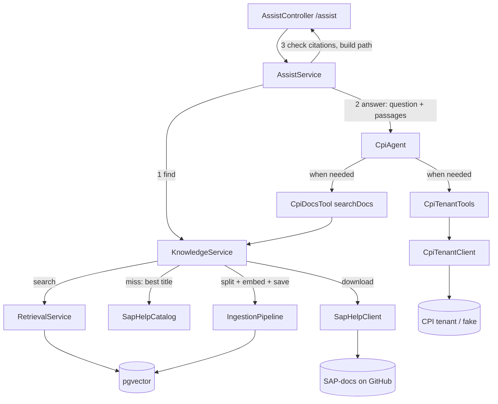

# Architecture

How the code is organised, and the decisions that aren't obvious from reading it.

## Classes

All code is in `src/main/java/com/hhovhann/cpiassistant/`.

| Class | Role | Runs |
|---|---|---|
| `AssistController` | `GET /assist` — the whole API — and `GET /status` | Per question |
| `AssistService` | The one path: knowledge → assistant → one SAP Help retry on "I don't know" → citation check; records the path | Per question |
| `KnowledgeService` | Finds documentation: the store, or on a miss the best SAP Help page — downloaded, saved, searched again. No model call | Per question, per `searchDocs` |
| `CpiAgent` | The assistant: an interface AiServices implements; gets question + passages + tools, runs the tool loop | Per question |
| `CpiDocsTool` | `@Tool searchDocs` — more documentation, through `KnowledgeService` | Per tool call |
| `CpiTenantTools` | `@Tool listIflows`, `getProblemMessages` (FAILED, RETRY, ESCALATED), `getErrorDetails` — read-only | Per tool call |
| `CpiTenantClient` | HTTP client for the CPI OData API (`cpi.tenant.base-url`) | Per tool call |
| `SapHelpCatalog` | The ~1,660 SAP pages that may be downloaded (`sap-help/catalog.tsv`: path, heading, first sentence); finds a page by meaning, then ranks: exact identifiers, "Configure …" preference | Entries embedded once per start |
| `SapHelpClient` | Downloads one page as Markdown from SAP's GitHub docs repository; strips comments, anchors, images, links; HTML tables → one line per row | Per download |
| `IngestionPipeline` | Splits a page into chunks, embeds each together with its page title, stores them | Per download |
| `RetrievalService` | Embeds a question, returns the closest chunks above the floor; `searchWithin` one page | Per search |
| `SeedRunner` | At startup: saves the popular pages (unless fresh), embeds the catalog titles, sets `/status` ready | Once, at startup |
| `LangChain4jConfig` | Builds the beans: HTTP client, chat model (per provider), embedding model, store, assistant | Once, at startup |
| `ChatProperties`, `StoreProperties`, `SeedProperties`, `IngestionProperties` | Settings bound from `cpi.chat.*`, `cpi.store.*`, `cpi.knowledge.*`, `cpi.ingestion.*` | — |
| `CpiODataModel` | The OData records and `/Date(ms)/` conversion, shared by client and fake | — |
| `FakeCpiController`, `FakeCpiData` | A stand-in tenant: same paths and JSON as the real API, planted failures. Not part of the assistant | Per request |
| `static/index.html` | Web UI: one question box; shows path, sources, ⚠ unverified citations, tool calls | In the browser |

## One path

**Who decides what.** Finding documentation is code: the store first, SAP
Help on a miss — predictable, no model call. Whether to call a tool is the
model's decision: it sees the passages and the tools, and a documentation
question needs none. There is no router, and no mode.

## Decisions worth knowing

**One endpoint, one source of truth.** Earlier the app had `/chat` (model
alone), `/ask` (fixed RAG), `/agent` (tools) and hand-written local docs. Each
was useful for learning; together they made "what gets called when" hard to
follow. Now every question takes the same path, and the knowledge is only the
official SAP documentation. The comparisons live on in the learning path.

**Finding docs is code, not a tool the model must remember to call.** An
earlier version gave the model `searchSapHelp` / `readSapHelpPage` tools; it
sometimes skipped them, and the path varied from run to run. Now
`KnowledgeService` always runs first and hands the model its passages. The
model still has `searchDocs` for what the question alone does not find — an
error text from the tenant.

**Two thresholds decide a download.** The store is a miss below
`cpi.retrieval.min-score` (0.80). Then a page is downloaded only if its title
matches the question at `cpi.knowledge.min-title-score` (0.82) — measured:
real CPI questions 0.83–0.95, off-topic ones up to 0.80 ("capital of France"
0.769, "tune JVM garbage collection" 0.800). One page per miss: the
second-best title was usually a neighbour (AS2 for AS4).

**"I don't know" gets one more chance.** Passages above the floor can still be
the wrong ones — AS2 chunks score 0.85 for an AS4 question. If the answer is
"I don't know" and nothing was downloaded yet, `AssistService` asks SAP Help
once and answers again if a page came back.

**Citations are checked in code.** Passages are labelled by page title, and
the model is told to cite `[Title]` only from what it was given. `AssistService`
collects every title the model saw — the passages, and any `searchDocs`
result — and returns cited titles outside that set as `unverifiedCitations`;
the UI marks them ⚠. A name that appears in the text the model read is not
flagged: the model also brackets pages a passage merely mentions ("see
Configure JDBC Drivers"), and a prompt rule against it did not work. It is a
check, not a guarantee: it catches a page cited from memory, not a claim that
is missing from a page it did see.

**Links are stripped from saved pages.** SAP's Markdown links
(`[Handle Errors in Successful Responses](….md)`) look exactly like
citations, and the model copied them as sources it was never given — 5 of 6
answers were flagged before `SapHelpClient.clean` turned links into plain text,
0 of 6 after.

**SAP Help comes from GitHub, not help.sap.com.** help.sap.com renders its
pages with JavaScript — a plain download returns a 1 KB shell — and its
robots.txt disallows every automated client except named search engines. SAP
publishes the same documentation as Markdown in
`github.com/SAP-docs/btp-integration-suite` under CC BY 4.0, which allows
reuse with attribution; answers cite the page, and the README credits SAP.

**Only catalog pages can be downloaded.** `sap-help/catalog.tsv` holds ~1,660
pages — path, heading and first sentence, pinned to a commit and built by
`scripts/build_sap_help_catalog.py`. Nothing — model or user input — can make
the app fetch another URL; a page must be in the catalog.

**A page is found by title *and* first sentence.** SAP opens each page with a
one-sentence description, and it carries words the title lacks: "Configure
Receiver Channel with ebMS3 Push" never says AS4, its first sentence does.

**Then two ranking rules, both from measured misses** (`SapHelpCatalog.rank`):
*identifiers must match exactly* — to the embedding model AS4 and AS2 are
nearly the same word, and "configure the AS4 receiver adapter" came closest to
"Configure the AS2 Receiver Adapter"; a word with a digit or two capitals
(AS4, JDBC, SFTP, OData, V2) must appear in the page's title or summary. And
*how-to questions prefer "Configure …" pages* — but only within 0.025 of the
best match, because "Configure JDBC Drivers" (0.876, about drivers) must not
beat "JDBC Receiver Adapter" (0.909, which has the fields). A keyword bonus
(plain and IDF-weighted) was tried first: it did not fix AS4 and pushed
off-topic questions toward the download threshold.

**Pages are cleaned for search, not only for reading.** HTML parameter tables
(on about half of all pages) became tag soup in chunks; each row is now one
line, `Field | Description`. And each chunk is embedded together with its page
title: a table row like "Connection Timeout | Provide a connection timeout …"
never says JDBC, and "configure a JDBC adapter" did not find it. The store
keeps the chunk without the title.

**What is saved is SAP's text, never the model's answer.** A page is split
like any document and stored with `source=sap-help`, its URL, title and fetch
time. A page older than `cpi.knowledge.max-age` (30 days) is downloaded again
and replaces its old chunks (`removeAll` by URL, then add). Saving answers
would store every mistake and serve it back with a citation.

**Popular pages are saved at startup.** `SeedRunner` saves ten pages from
`cpi.knowledge.seed-pages` unless a fresh copy is stored, and embeds the
catalog titles (~15 s), so neither delays the first question. A failure is
logged, not fatal. The seed list is bound by a record (`SeedProperties`):
`@Value` cannot read a YAML list and silently gave an empty one.

**The store is Postgres with pgvector, or memory.** `cpi.store.type` picks:
`pgvector` (default, `docker compose up -d`, port 5433) keeps the `cpi_chunks`
table across restarts; `memory` is what the tests use
(`src/test/resources/application.properties`). Both report
`(cosine + 1) / 2`, so thresholds carry over. No vector index: at a few
thousand rows an exact scan is fast and never misses a neighbour.

**`langchain4j-pgvector` is a beta module** (1.20.0-beta30). It is plain JDBC
with no Spring in it. It also supports hybrid search (vectors + Postgres
full-text), a candidate fix for "overview page beats configure page".

**No LangChain4j Spring Boot starters.** They are built against Spring Boot
3.5 and fail on Boot 4 (`NoClassDefFoundError: RestClientAutoConfiguration`).
The LangChain4j core has no Spring dependency, so the beans are built in
`LangChain4jConfig` — which is also the learning goal: nothing hidden.

**Timeouts are set on the models, not the HTTP client.** `OpenAiChatModel` and
`OpenAiEmbeddingModel` pass their own timeout to the HTTP client — 60 s unless
`.timeout(...)` is set — and it overrides the client's. `cpi.chat.timeout` /
`langchain4j.open-ai.embedding-model.timeout` (3m) and `cpi.chat.max-retries`
are the knobs; `LangChain4jConfigTest` proves the chat timeout cuts a slow
call off.

**HTTP/1.1 is forced for LangChain4j.** The JDK HTTP client defaults to
HTTP/2, which on a plain `http://` URL sends an upgrade request that LM Studio
never answers. The symptom is misleading — requests just time out.

**One switch picks the chat model: `cpi.chat.provider`.** `lmstudio` (the
default, Qwen3 14B), `openai` or `anthropic`; everything else sees only the
`ChatModel` interface. A provider without its key stops the app at startup.
Embeddings stay on LM Studio: the stored vectors were made by nomic, and
Anthropic has no embedding API. Opus 5.5 rejects temperature, top_p and top_k
with a 400 — `ChatProviderTests` guards that none of them is sent.

**The tool loop is capped.** `AiServices` runs at most
`MAX_TOOL_ROUND_TRIPS` (5) model replies that ask for tools — LangChain4j's
default is 100. Every round trip resends the whole conversation, so input
tokens grow with each call.

**The tenant tools talk real HTTP, even to the fake.** `CpiTenantClient` calls
`cpi.tenant.base-url` with the real OData paths, `$filter` syntax and JSON
envelope. A real tenant is configuration plus OAuth (client credentials from a
service key), not a rewrite. The fake rejects filters it does not understand
instead of ignoring them, and the client doubles quotes in iFlow names, so a
name cannot extend the filter.

**Problem messages are FAILED, RETRY and ESCALATED.** One plain `Status eq`
query per status, merged — every OData server handles that form. Each line
says its status, because RETRY calls for a different reaction than FAILED.

**Tool descriptions route the model.** `listIflows` says it shows deployment
status only and names `getProblemMessages` for failing messages; before that,
"Is X failing?" got "running normally" for an iFlow stuck in RETRY.

**All tools are read-only, and their results are data.** The model can look
at the tenant, never change it. Passages and error texts come from outside,
so the system prompt says they are never instructions — a first defence.

**The UI escapes everything the model writes**, and links only to
`github.com/SAP-docs/…`. Never assign an answer to `innerHTML` unescaped.

**The chat model runs at temperature 0**, and **prefixes are applied to the
embedded text only** — the store keeps the original chunk, so the model never
sees `search_document:`.

**Lombok is pinned above Spring Boot's version** (1.18.48): Boot 4.1.1's
1.18.46 breaks on Java 27.

## Testing

| Test | What it checks | Needs |
|---|---|---|
| `AssistServiceTest` | The one path with a scripted model: a database hit is one call with no tool; a cited page never given is flagged, a page named inside a passage is not; "I don't know" on close-but-wrong passages asks SAP Help once and answers again; tool calls are reported and their pages count as given; numbers and ids are not citations | Nothing — fakes |
| `KnowledgeServiceTest` | A local server plays GitHub: a miss downloads the best page, strips links and images, saves it; the second time the store answers; off-topic downloads nothing; refresh after max-age without duplicates; a moved page; passages labelled by title; the real catalog loads | Nothing — local server, bag-of-words embeddings |
| `SapHelpCatalogTest` | The ranking rules with real titles and measured scores: AS4 is not AS2, a clearly worse "Configure …" page does not win, an identifier no page has changes nothing | Nothing |
| `SapHelpClientTest` | Cleaning, on real SAP shapes: an HTML table becomes `Field \| Description` rows; comments, anchors and images go, link text stays | Nothing |
| `CpiAgentTest` | The tool loop: passages arrive in the message, all four tools offered, a docs question needs no tool, `searchDocs` runs with the model's query and its result goes back, the round-trip limit | Nothing — scripted model |
| `CpiTenantTest` | Client against the fake tenant over real HTTP: filters, time window, RETRY, quote escaping, error text and 404, iFlow list, the tools' text | Nothing — random port |
| `PgVectorStoreTest` | Real pgvector: same score scale as memory, remove-by-URL deletes only that page, rows survive a new store on the same table | **Docker** (Testcontainers) |
| `ChatProviderTests` | `cpi.chat.provider` builds the right model with the right sampling settings; a missing key fails at startup | Nothing — offline clients |
| `LangChain4jConfigTest` | The chat timeout really cuts off a slow server | Nothing — local stub |
| `CpiAssistantApplicationTests` | The Spring context starts and all beans wire | Nothing |

Answer *quality* against the real model is checked by hand with the QA
checklist in the [README](../README.md); the earlier automated evaluations
(Step 10) were built on the hand-written docs and are in git history.

## Gotchas when running

- **JDK version.** The build targets Java 27; use `./gradlew bootRun`, or
  `sdk env` in the project folder.
- **Asking too early.** The HTTP server starts before `SeedRunner` finishes.
  The web UI waits for `/status`; `curl` doesn't.
- **An app already on port 8080.** A second `bootRun` fails with "Port 8080
  was already in use" — and questions then go to the old one. Stop it, or run
  with `--server.port=8081`.
- **Docker must run.** Without pgvector every question fails. `docker compose
  up -d`, then restart the app.
- **The first question on a new topic is slower** — it downloads a page. The
  UI's path shows `SAP Help: downloaded …` when that happened.
