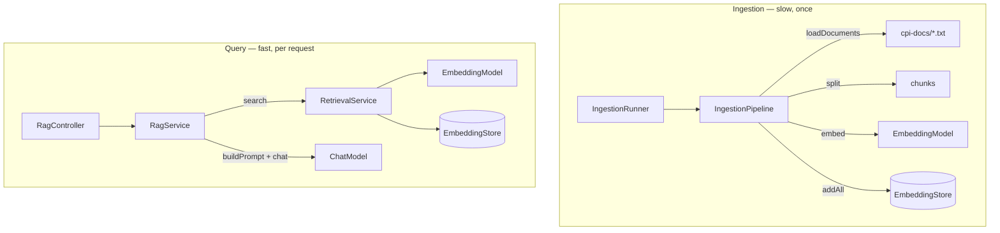

# Architecture

How the code is organised, and the decisions that aren't obvious from reading it.

## Classes

All code is in `src/main/java/com/hhovhann/cpiassistant/`.

| Class | Role | Runs |
|---|---|---|
| `LangChain4jConfig` | Builds the LangChain4j beans: HTTP client, chat model, embedding model, vector store | Once, at startup |
| `IngestionProperties` | Chunking settings bound from `cpi.ingestion.*` | — |
| `IngestionPipeline` | Loads the docs, splits them into chunks, embeds and stores them | Once, at startup |
| `IngestionRunner` | Drives the pipeline at startup and logs stats plus probe searches | Once, at startup |
| `RetrievalService` | Embeds a question and returns the closest chunks above the score floor | Per question |
| `RagService` | Retrieve → build prompt → call the LLM → answer with sources and tokens | Per question |
| `RagController` | `GET /ask` | Per question |
| `LangChain4jChatController` | `GET /chat` — the LLM alone, no retrieval | Per question |
| `SpringAiChatController` | `GET /springai/chat` — the same through Spring AI | Per question |

## Two halves: ingestion and retrieval

They are separate classes on purpose: ingestion runs once and may take
seconds; retrieval runs on every question and must be fast. They share two
beans — the `EmbeddingModel` (must be the same on both sides) and the
`EmbeddingStore`.

## Two frameworks side by side

| | Track A — LangChain4j | Track B — Spring AI |
|---|---|---|
| Wiring | By hand, in `LangChain4jConfig` | Spring Boot auto-configuration |
| Config | `langchain4j.open-ai.*` | `spring.ai.openai.*` |
| Endpoints | `/chat`, `/ask` | `/springai/chat` |
| Status | Full RAG pipeline | Plain chat only (Phase 3) |

Both talk to the same LM Studio server.

## Decisions worth knowing

**No LangChain4j Spring Boot starters.** They are built against Spring Boot
3.5 and fail on Boot 4 (`NoClassDefFoundError: RestClientAutoConfiguration`).
The LangChain4j core has no Spring dependency, so the beans are built in
`LangChain4jConfig` instead. That is also the learning goal: nothing hidden.

**HTTP/1.1 is forced for LangChain4j.** The JDK HTTP client defaults to
HTTP/2, which on a plain `http://` URL sends an upgrade request that LM Studio
never answers. The symptom is misleading — requests just time out, as if the
model were slow. See the comment on `langChain4jHttpClientBuilder()`.

**Spring AI's base URL must end in `/v1`.** Spring AI 2.0 doesn't add it. Get
it wrong and LM Studio returns HTTP 200 with an error body, so the failure
looks like a parsing bug (`` `choices` is not set ``), not a 404.

**The vector store is in memory.** Embeddings are rebuilt on every startup
(~1.5 s for 207 chunks). Fine at this size; pgvector is the planned
replacement, behind the same `EmbeddingStore` interface.

**Retrieval scores are `(cosine + 1) / 2`,** not raw cosine. The `0.80` floor
is on that scale, and is specific to nomic-embed-text with task prefixes.

**Prefixes are applied to the embedded text only.** `IngestionPipeline.embed()`
embeds a prefixed copy but stores the original chunk, so the LLM never sees
`search_document:`.

## Testing

| Test | What it checks | Needs LM Studio? |
|---|---|---|
| `RagServiceTest` | Prompt contents, answer mapping, empty retrieval, missing token usage | No — hand-written fakes |
| `CpiAssistantApplicationTests` | The Spring context starts and all beans wire | No — sets `cpi.ingestion.run-on-startup=false` |

Answer *quality* against a real model is not unit-tested — that belongs to
evaluation (Step 10 in the [learning path](LEARNING-PATH.md)).

## Gotchas when running

- **JDK version.** The build targets Java 26. `java -jar` on an older default
  JDK fails with `UnsupportedClassVersionError`; use `./gradlew bootRun`.
- **Asking too early.** The HTTP server starts before ingestion finishes. A
  question asked before the `Embedded N segments` log line finds nothing and
  gets "I don't know".
- **First request is slow.** LM Studio loads the model into memory on first
  use. The read timeout is 3 minutes for that reason.
