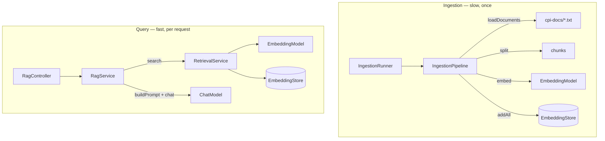

# Architecture

How the code is organised, and the decisions that aren't obvious from reading it.

## Classes

All code is in `src/main/java/com/hhovhann/cpiassistant/`.

| Class | Role | Runs |
|---|---|---|
| `LangChain4jConfig` | Builds the LangChain4j beans: HTTP client, chat model, embedding model, vector store | Once, at startup |
| `IngestionProperties` | Chunking settings bound from `cpi.ingestion.*` | — |
| `ChatProperties` | Which chat model answers, bound from `cpi.chat.*`: `provider` plus settings per provider | — |
| `IngestionPipeline` | Loads the docs, splits them into chunks, embeds and stores them | Once, at startup |
| `IngestionRunner` | Drives the pipeline at startup and logs stats plus probe searches | Once, at startup |
| `RetrievalService` | Embeds a question and returns the closest chunks above the score floor | Per question |
| `RagService` | Retrieve → build a numbered prompt → call the LLM → parse the answer's `[n]` citations into sources | Per question |
| `RagController` | `GET /ask`, and `GET /status` for readiness | Per question |
| `ChatController` | `GET /chat` — the LLM alone, no retrieval | Per question |
| `CpiDocsTool` | `@Tool searchCpiDocs(query)` — retrieval the model can call | Per tool call |
| `CpiAgent` | Interface that AiServices implements: runs the tool loop until the model answers | Per question |
| `AgentController` | `GET /agent` — the agent's answer plus every tool call it made | Per question |
| `CpiTenantTools` | `@Tool listIflows`, `getFailedMessages`, `getErrorDetails` — read-only tenant tools | Per tool call |
| `CpiTenantClient` | HTTP client for the CPI OData API (`cpi.tenant.base-url`) | Per tool call |
| `CpiODataModel` | The OData records and `/Date(ms)/` conversion, shared by client and fake | — |
| `FakeCpiController`, `FakeCpiData` | A stand-in tenant: same paths and JSON as the real API, planted failures | Per request |
| `static/index.html` | Web UI: calls `/status`, `/ask` and optionally `/chat` | In the browser |

## Two halves: ingestion and retrieval

They are separate classes on purpose: ingestion runs once and may take
seconds; retrieval runs on every question and must be fast. They share two
beans — the `EmbeddingModel` (must be the same on both sides) and the
`EmbeddingStore`.

## Decisions worth knowing

**No LangChain4j Spring Boot starters.** They are built against Spring Boot
3.5 and fail on Boot 4 (`NoClassDefFoundError: RestClientAutoConfiguration`).
The LangChain4j core has no Spring dependency, so the beans are built in
`LangChain4jConfig` instead. That is also the learning goal: nothing hidden.

**Timeouts are set on the models, not the HTTP client.** `OpenAiChatModel` and
`OpenAiEmbeddingModel` pass their own timeout to the HTTP client — 60 s unless
`.timeout(...)` is set — and it overrides the client's. A 3-minute timeout on the
client was silently ignored until the answer evaluation hit it.
`cpi.chat.timeout` / `langchain4j.open-ai.embedding-model.timeout` (default
3m) and `cpi.chat.max-retries` are the knobs; `LangChain4jConfigTest` proves
the chat timeout really cuts a slow call off.

**HTTP/1.1 is forced for LangChain4j.** The JDK HTTP client defaults to
HTTP/2, which on a plain `http://` URL sends an upgrade request that LM Studio
never answers. The symptom is misleading — requests just time out, as if the
model were slow. See the comment on `langChain4jHttpClientBuilder()`.

**The vector store is in memory.** Embeddings are rebuilt on every startup
(~1.5 s for 207 chunks). Fine at this size; pgvector is the planned
replacement, behind the same `EmbeddingStore` interface.

**Retrieval scores are `(cosine + 1) / 2`,** not raw cosine. The `0.80` floor
is on that scale, and is specific to nomic-embed-text with task prefixes. It is
a trade-off, not a clean cut: the evaluation shows an off-topic technical
question scoring 0.82 and some correct chunks just under 0.80.

**The UI escapes everything the model writes.** LLM output is untrusted —
it is built from documents and user input — so `index.html` escapes it before
adding its own markup. Never assign an answer to `innerHTML` unescaped.

**Lombok is pinned above Spring Boot's version.** Boot 4.1.1 manages Lombok
1.18.46, which breaks on Java 27; `build.gradle.kts` overrides it to 1.18.48.
A new JDK often breaks Lombok first, because it hooks into compiler internals.

**One switch picks the chat model: `cpi.chat.provider`.** `lmstudio` (the
default), `openai` or `anthropic`; `LangChain4jConfig.chatModel` builds the
matching model, and everything else sees only the `ChatModel` interface.
LM Studio and OpenAI share one client, since LM Studio speaks the OpenAI API.
A provider without its key stops the app at startup with the variable to
export, instead of failing on the first question. Only the chat model moves:
embeddings stay on LM Studio, because the stored vectors were made by nomic
and Anthropic has no embedding API. Opus 5.5 rejects temperature, top_p and
top_k with a 400 — `ChatProviderTests` guards that none of them is sent. It always thinks,
and thinking counts toward `max-tokens` (16,000); LangChain4j 1.20 cannot set
effort, so it runs at the model's default, `medium`.

**`/ask` retrieves every time; `/agent` lets the model decide.** `/ask` is a
fixed pipeline: search, then answer. `/agent` hands the model a `searchCpiDocs`
tool and lets it choose whether to search, with what words, and how often.
The loop is LangChain4j's `AiServices`, capped at `MAX_TOOL_ROUND_TRIPS` (5)
model replies that ask for tools — LangChain4j's own default is 100. Every
round trip resends the whole conversation, so input tokens grow with each
search. Citations are file names (`[02-jdbc-adapter.txt]`), because the
numbers of passages from several searches would clash.

**The tenant tools talk real HTTP, even to the fake.** `CpiTenantClient` calls
`cpi.tenant.base-url` with the real OData paths, `$filter` syntax and JSON
envelope; the fake tenant happens to live in the same app. Switching to a real
tenant is configuration plus OAuth (client credentials from a service key),
not a rewrite. The fake rejects filters it does not understand instead of
ignoring them — an ignored condition would return wrong data that looks right.
The client doubles quotes in iFlow names, so a name cannot extend the filter.

**All tools are read-only, and their results are data.** The model can look
at the tenant, never change it. Error texts come from a remote system, so the
system prompt says tool results are never instructions — a first defence; a
tool-use evaluation with a planted injection is the real test.

**The chat model runs at temperature 0.** Answers from documentation should be
factual, and the evaluations need repeatable runs.

**Prefixes are applied to the embedded text only.** `IngestionPipeline.embed()`
embeds a prefixed copy but stores the original chunk, so the LLM never sees
`search_document:`.

## Testing

| Test | What it checks | Needs LM Studio? |
|---|---|---|
| `RagServiceTest` | Prompt contents and numbering, citation parsing and its edge cases, answer mapping, empty retrieval, missing token usage | No — hand-written fakes |
| `CpiAssistantApplicationTests` | The Spring context starts and all beans wire | No — sets `cpi.ingestion.run-on-startup=false` |
| `LangChain4jConfigTest` | The configured chat timeout really cuts off a slow server (the 60 s override bug) | No — a local stub server |
| `ChatProviderTests` | `cpi.chat.provider` builds the right model: Qwen3 14B at temperature 0 by default, Claude and OpenAI without sampling parameters, a clear error when a key is missing | No — builds the clients offline with placeholder keys |
| `CpiAgentTest` | The tool loop with a scripted fake model: the tool is offered, runs with the model's query, its result goes back; answering without a search; an empty search; the round-trip limit | No — hand-written fakes |
| `CpiTenantTest` | Client against the fake tenant over real HTTP: filters, time window, RETRY not counted as failed, quote escaping, error text and 404, iFlow list, and the tools' text | No — the fake tenant, random port |
| `RetrievalEvaluation` | Retrieval quality across chunk sizes on a fixed question set — Hit@1, Hit@3, MRR, floor leaks | **Yes** — tagged `eval`, run with `./gradlew eval`, excluded from `./gradlew test` |
| `AnswerEvaluation` | Answer quality: RAG at 500/50 and 300/30 vs all docs in the prompt — key facts, declines, tokens, time | **Yes** — same `eval` tag; the chat model needs a ≥ 32K context |
| `CitationEvaluation` | Citation quality: each (claim, cited chunk) pair judged by the active chat model, plus embedding similarity | **Yes** — same `eval` tag and context |
| `CitationClaimsTest` | How answers split into claims: where markers belong, list numbers, lead-ins, bare citations | No — pure string logic |

Answer *quality* against a real model is not unit-tested — that belongs to
evaluation (Step 10 in the [learning path](LEARNING-PATH.md)).

The evaluation lives in the same package as the services so it can call
package-private overloads — `IngestionPipeline.split(docs, size, overlap)`,
`embedInto(segments, store)`, `RetrievalService.search(embedding, k, store, floor)`,
`RagService.answer(question, matches)`, and the `RagService.CITATION` pattern, so
the citation evaluation parses markers exactly as `/ask` does.
They let it build a fresh store per chunk size while running the app's own
code. `embedInto` does not update the `/status` counter, which is why it is
not public: it must never be used on the live store.

## Gotchas when running

- **JDK version.** The build targets Java 27. `java -jar` on an older default
  JDK fails with `UnsupportedClassVersionError`; use `./gradlew bootRun`, or
  run `sdk env` in the project folder to switch to the JDK in `.sdkmanrc`.
- **Asking too early.** The HTTP server starts before ingestion finishes. A
  question asked before the `Embedded N segments` log line finds nothing and
  gets "I don't know". The web UI checks `/status` and waits; `curl` doesn't.
- **First request is slow.** LM Studio loads the model into memory on first
  use, and a cold long prompt takes time to read (41 s for all 15 docs). The
  chat and embedding timeouts are 3 minutes for that reason.
