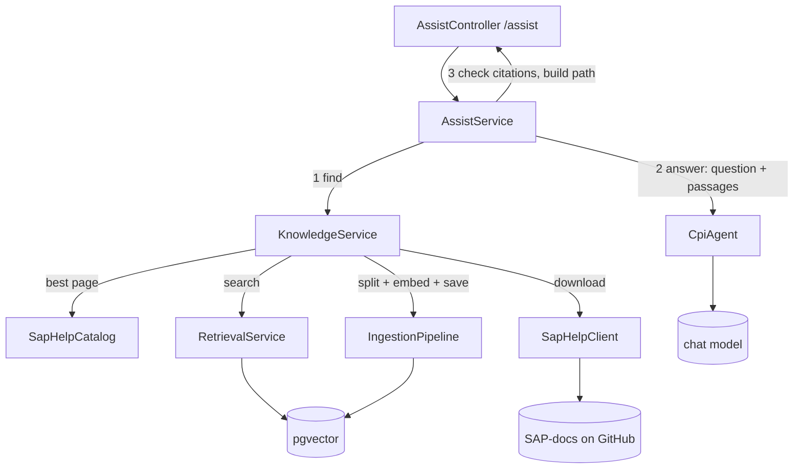

# Architecture

How the code is organised, and the decisions that aren't obvious from reading it.

## Classes

All code is in `src/main/java/com/hhovhann/cpiassistant/`.

| Class | Role | Runs |
|---|---|---|
| `AssistController` | `GET /assist` — the whole API — and `GET /status` | Per question |
| `AssistService` | The one path: knowledge → assistant (one model call) → citation check; records the path | Per question |
| `KnowledgeService` | Finds documentation: the best SAP Help page for the question (downloaded and saved the first time) and its best passages, plus the best passages in the store. No model call | Per question |
| `CpiAgent` | The assistant: an interface AiServices implements; gets question + passages, answers in one call | Per question |
| `SapHelpCatalog` | The ~1,660 SAP pages that may be downloaded (`sap-help/catalog.tsv`: path, heading, first sentence); finds a page by meaning and keywords; identifiers must match exactly | Entries embedded once per start |
| `SapHelpClient` | Downloads one page as Markdown from SAP's GitHub docs repository; strips comments, anchors, images, links; HTML tables → one line per row | Per download |
| `IngestionPipeline` | Splits a page into chunks, embeds each together with its page title, stores them | Per download |
| `RetrievalService` | Embeds a question, returns the closest chunks above the floor, re-ordered by meaning + keywords; `searchWithin` one page | Per search |
| `KeywordSearch` | Keyword ranking (BM25) and rank fusion (RRF) — the keyword half of hybrid search | Per search |
| `SeedRunner` | At startup: saves the popular pages (unless fresh), embeds the catalog titles, sets `/status` ready | Once, at startup |
| `LangChain4jConfig` | Builds the beans: HTTP client, chat model (per provider), embedding model, store, assistant | Once, at startup |
| `ChatProperties`, `StoreProperties`, `SeedProperties`, `IngestionProperties` | Settings bound from `cpi.chat.*`, `cpi.store.*`, `cpi.knowledge.*`, `cpi.ingestion.*` | — |
| `static/index.html` | Web UI: one question box; shows path, sources, ⚠ unverified citations | In the browser |

## One path

```mermaid
flowchart TB
    AC[AssistController /assist] --> AS[AssistService]
    AS -->|1 find| KS[KnowledgeService]
    KS -->|best page| CAT[SapHelpCatalog]
    KS -->|search| RS[RetrievalService] --> ST[(pgvector)]
    KS -->|download| CL[SapHelpClient] --> GH[(SAP-docs on GitHub)]
    KS -->|split + embed + save| IP[IngestionPipeline] --> ST
    AS -->|2 answer: question + passages| AG[CpiAgent] --> LLM[(chat model)]
    AS -->|3 check citations, build path| AC
```

**Who decides what.** Finding documentation is code: the best SAP page, then
the store — predictable, no model call. The model only writes the answer, from
the passages it is given. There are no tools, no router and no mode.

## Decisions worth knowing

**One endpoint, one source of truth.** Earlier the app had `/chat` (model
alone), `/ask` (fixed RAG), `/agent` (tools) and hand-written local docs. Each
was useful for learning; together they made "what gets called when" hard to
follow. Now every question takes the same path, and the knowledge is only the
official SAP documentation. The comparisons live on in the learning path.

**Finding docs is code, not a tool the model must remember to call.** An
earlier version gave the model `searchSapHelp` / `readSapHelpPage` tools; it
sometimes skipped them, and the path varied from run to run. Now
`KnowledgeService` always runs first and hands the model its passages.

**Docs only — no tools (Step 20).** Steps 12–13 gave the model a
`searchDocs` tool and three tools over a CPI tenant's OData API, backed by a
fake tenant, since no real one was connected. The tenant half never had a
real tenant behind it, and needed extra prompt rules and an iFlow-name hint to
work with a 14B model. `searchDocs` only mattered for looking up a tenant's
error text. Both were removed: one model call per question, no tool loop. The
tenant code is in git history (before Step 20) if a real tenant comes.

**The best page first, not only on a miss.** Earlier the store was searched
first and SAP Help asked only when nothing scored above 0.80. But passages
above the floor can be the wrong ones — AS2 chunks score 0.85 for an AS4
question — so the app needed an "I don't know → ask SAP Help again" retry, a
graph hop to reach pages a passage names, and extra passages after a
download. Now every question looks up its best catalog page first: saved
the first time, from the store after that, its three best passages always in
the answer, plus the three best from the whole store. One rule replaced three
patches, and the AS4 question went from four model calls to one.

**Two thresholds.** A page is used only if it matches the question at
`cpi.knowledge.min-title-score` (0.82) — measured: real CPI questions
0.83–0.95, off-topic ones up to 0.80 ("capital of France" 0.769, "tune JVM
garbage collection" 0.800). A passage from the whole store only at
`cpi.retrieval.min-score` (0.80).

**An empty answer is never passed on.** Qwen3 has returned only its thinking
and no text; the app answers "The model returned no answer. Please ask again."
instead of `null`.

**Questions are 1 to 1,000 characters.** Checked in `AssistController` before
any model call (HTTP 400 otherwise); every character goes into the prompt.

**Citations are checked in code.** A bracket right after a word or a slash is
code, not a citation (`payload/LogEntry[severity = 'Error']`). Passages are labelled by page title, and
the model is told to cite `[Title]` only from what it was given. `AssistService`
collects the title of every passage the model was given and returns cited
titles outside that set as `unverifiedCitations` (a URL or an id in brackets
is not a citation);
the UI marks them ⚠. A name that appears in the text the model read is not
flagged: the model also brackets pages a passage merely mentions ("see
Configure JDBC Drivers"), and a prompt rule against it did not work. It is a
check, not a guarantee: it catches a page cited from memory, not a claim that
is missing from a page it did see.

**Links are stripped from saved pages.** SAP's Markdown links
(`[Handle Errors in Successful Responses](….md)`) look exactly like
citations, and the model copied them as sources it was never given — 5 of 6
answers were flagged before `SapHelpClient.clean` turned links into plain text,
0 of 6 after.

**SAP Help comes from GitHub, not help.sap.com.** help.sap.com renders its
pages with JavaScript — a plain download returns a 1 KB shell — and its
robots.txt disallows every automated client except named search engines. SAP
publishes the same documentation as Markdown in
`github.com/SAP-docs/btp-integration-suite` under CC BY 4.0, which allows
reuse with attribution; answers cite the page, and the README credits SAP.

**Only catalog pages can be downloaded.** `sap-help/catalog.tsv` holds ~1,660
pages — path, heading and first sentence, pinned to a commit and built by
`scripts/build_sap_help_catalog.py`. Nothing — model or user input — can make
the app fetch another URL; a page must be in the catalog.

**A page is found by title *and* first sentence.** SAP opens each page with a
one-sentence description, and it carries words the title lacks: "Configure
Receiver Channel with ebMS3 Push" never says AS4, its first sentence does.

**Then one ranking rule, from a measured miss** (`SapHelpCatalog.rank`):
*identifiers must match exactly* — to the embedding model AS4 and AS2 are
nearly the same word, and "configure the AS4 receiver adapter" came closest to
"Configure the AS2 Receiver Adapter"; a word with a digit or two capitals
(AS4, JDBC, SFTP, OData, V2) must appear in the page's title or summary. The "Configure …" preference that used to follow was dropped in Step 20: with hybrid search and the best page's passages in every answer, `scripts/qa.sh` passes without it.

**Pages are cleaned for search, not only for reading.** HTML parameter tables
(on about half of all pages) became tag soup in chunks; each row is now one
line, `Field | Description`. And each chunk is embedded together with its page
title: a table row like "Connection Timeout | Provide a connection timeout …"
never says JDBC, and "configure a JDBC adapter" did not find it. The store
keeps the chunk without the title.

**What is saved is SAP's text, never the model's answer.** A page is split
like any document and stored with `source=sap-help`, its URL, title and fetch
time. A page older than `cpi.knowledge.max-age` (30 days) is downloaded again
and replaces its old chunks (`removeAll` by URL, then add). Saving answers
would store every mistake and serve it back with a citation.

**Popular pages are saved at startup.** `SeedRunner` saves ten pages from
`cpi.knowledge.seed-pages` unless a fresh copy is stored, and embeds the
catalog titles (~15 s), so neither delays the first question. A failure is
logged, not fatal. The seed list is bound by a record (`SeedProperties`):
`@Value` cannot read a YAML list and silently gave an empty one.

**The store is Postgres with pgvector, or memory.** `cpi.store.type` picks:
`pgvector` (default, `docker compose up -d`, port 5433) keeps the `cpi_chunks`
table across restarts; `memory` is what the tests use
(`src/test/resources/application.properties`). Both report
`(cosine + 1) / 2`, so thresholds carry over. No vector index: at a few
thousand rows an exact scan is fast and never misses a neighbour.

**`langchain4j-pgvector` is a beta module** (1.20.0-beta30). It is plain JDBC
with no Spring in it. Its own hybrid mode is not used — see below.

**Hybrid search is BM25 in Java (`KeywordSearch`), fused by rank.** The catalog fuses its 20
best pages by meaning with its 20 best by keywords; passages: 4× candidates
above the floor, re-ordered. Reciprocal rank fusion (k = 60) needs no common
score scale, and every result keeps its similarity score, so the 0.80 and 0.82
thresholds are unchanged. Keywords re-order passages but never add one below
the floor. pgvector's `searchMode` hybrid was rejected: it returns RRF scores
(~0.02) that break the thresholds, `plainto_tsquery` needs every word in one
chunk, and the in-memory store the tests use has no such mode.

**No LangChain4j Spring Boot starters.** They are built against Spring Boot
3.5 and fail on Boot 4 (`NoClassDefFoundError: RestClientAutoConfiguration`).
The LangChain4j core has no Spring dependency, so the beans are built in
`LangChain4jConfig` — which is also the learning goal: nothing hidden.

**Timeouts are set on the models, not the HTTP client.** `OpenAiChatModel` and
`OpenAiEmbeddingModel` pass their own timeout to the HTTP client — 60 s unless
`.timeout(...)` is set — and it overrides the client's. `cpi.chat.timeout` /
`langchain4j.open-ai.embedding-model.timeout` (3m) and `cpi.chat.max-retries`
are the knobs; `LangChain4jConfigTest` proves the chat timeout cuts a slow
call off.

**HTTP/1.1 is forced for LangChain4j.** The JDK HTTP client defaults to
HTTP/2, which on a plain `http://` URL sends an upgrade request that LM Studio
never answers. The symptom is misleading — requests just time out.

**One switch picks the chat model: `cpi.chat.provider`.** `lmstudio` (the
default, Qwen3 14B), `openai` or `anthropic`; everything else sees only the
`ChatModel` interface. A provider without its key stops the app at startup.
Embeddings stay on LM Studio: the stored vectors were made by nomic, and
Anthropic has no embedding API. Opus 5.5 rejects temperature, top_p and top_k
with a 400 — `ChatProviderTests` guards that none of them is sent.

**Passages are data, never instructions.** They come from outside, so the
system prompt says to ignore any instructions inside them — a first defence.
The app only reads: it downloads catalog pages and answers; nothing the model
writes is executed or saved.

**The UI escapes everything the model writes**, and links only to
`github.com/SAP-docs/…`. Never assign an answer to `innerHTML` unescaped.

**The chat model runs at temperature 0**, and **prefixes are applied to the
embedded text only** — the store keeps the original chunk, so the model never
sees `search_document:`.

**Lombok is pinned above Spring Boot's version** (1.18.48): Boot 4.1.1's
1.18.46 breaks on Java 27.

## Testing

| Test | What it checks | Needs |
|---|---|---|
| `AssistServiceTest` | The one path with a scripted model: a database hit is one call; a cited page never given is flagged, a page named inside a passage is not; an empty answer is never passed on; numbers, ids and URLs are not citations | Nothing — fakes |
| `KnowledgeServiceTest` | A local server plays GitHub: the best page is downloaded, stripped of links and images, saved and answered from; the second time it comes from the store; off-topic downloads nothing; the page's passages and the store's best are combined without duplicates; refresh after max-age without duplicates; a moved page; passages labelled by title; the real catalog loads | Nothing — local server, bag-of-words embeddings |
| `SapHelpCatalogTest` | The ranking rule with real titles and measured scores: AS4 is not AS2, an identifier no page has changes nothing | Nothing |
| `KeywordSearchTest` | The rare word decides; stop words are not searched; fusion rewards agreement between lists; keywords lift a passage both lists like but add none, and scores stay similarities | Nothing |
| `SapHelpClientTest` | Cleaning, on real SAP shapes: an HTML table becomes `Field \| Description` rows; comments, anchors and images go, link text stays | Nothing |
| `CpiAgentTest` | The wiring: question and passages reach the model in one call, with no tools | Nothing — scripted model |
| `PgVectorStoreTest` | Real pgvector: same score scale as memory, remove-by-URL deletes only that page, rows survive a new store on the same table | **Docker** (Testcontainers) |
| `ChatProviderTests` | `cpi.chat.provider` builds the right model with the right sampling settings; a missing key fails at startup | Nothing — offline clients |
| `LangChain4jConfigTest` | The chat timeout really cuts off a slow server | Nothing — local stub |
| `CpiAssistantApplicationTests` | The Spring context starts and all beans wire | Nothing |
| `RagVsFileSearchMeasurement` | Not a test: RAG against an agent that searches (BM25) and reads the SAP pages, same questions and model — tokens and calls counted at the model, time, right, grounded. Own table `cpi_chunks_measure`, reset to the seed pages every run. Tagged `measure`, run with `./gradlew measure` | LM Studio, pgvector, internet |

Answer *quality* against the real model: `scripts/qa.sh` asks eight questions
and checks the path and sources of each answer (see the [README](../README.md)). The
earlier automated evaluations (Step 10) were built on the hand-written docs
and are in git history.

## Gotchas when running

- **JDK version.** The build targets Java 27; use `./gradlew bootRun`, or
  `sdk env` in the project folder.
- **Asking too early.** The HTTP server starts before `SeedRunner` finishes.
  The web UI waits for `/status`; `curl` doesn't.
- **An app already on port 8080.** A second `bootRun` fails with "Port 8080
  was already in use" — and questions then go to the old one. Stop it, or run
  with `--server.port=8081`.
- **Docker must run.** Without pgvector every question fails. `docker compose
  up -d`, then restart the app.
- **The first question on a new topic is slower** — it downloads a page. The
  UI's path shows `SAP Help: downloaded …` when that happened.
